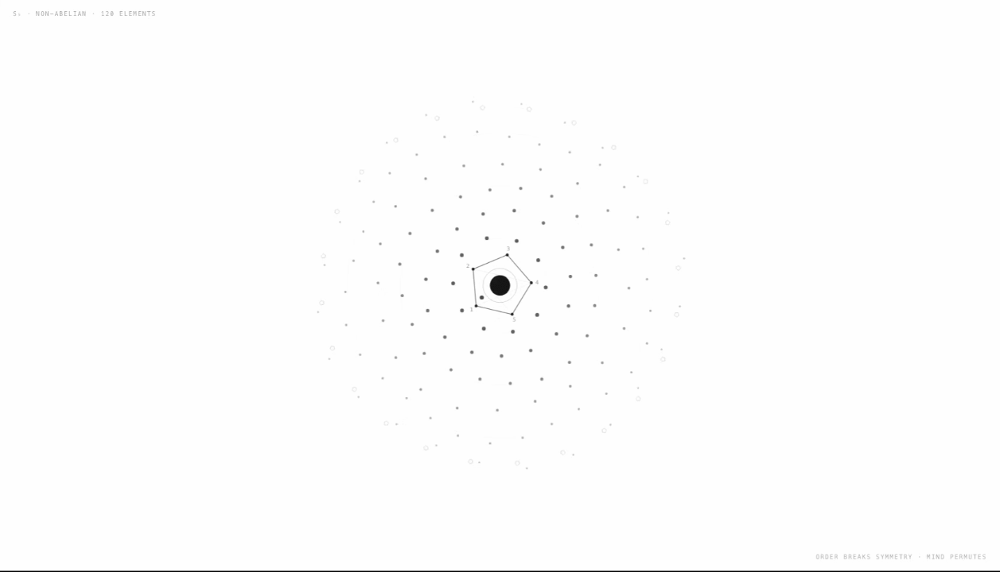
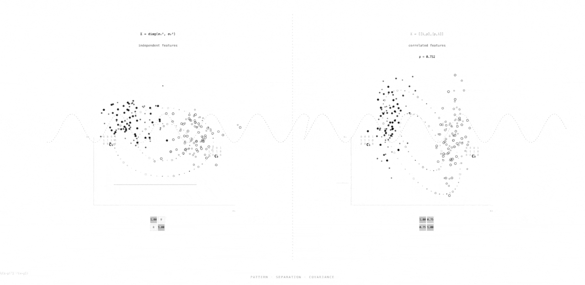

# Murmuration

Your AI conversations, taking flight as generative art.

A Chrome extension that transforms your ChatGPT and Claude conversation topics into beautiful, animated black-and-white visualizations on every new tab — like starlings moving as one across the sky, individual fragments coalescing into something transcendent.



## How It Works

1. **Scrapes** conversation titles from ChatGPT and Claude sidebars via content scripts
2. **Generates** self-contained HTML/CSS/JS art pieces via OpenRouter LLM API
3. **Displays** art in a sandboxed iframe on every new tab, biased towards recent pieces (exponential decay with factor 0.95). The refresh button picks uniformly at random from all stored art. Up to 100 artifacts are kept.



## Project Structure

```
murmuration/
├── manifest.json              # Chrome MV3 extension manifest
├── background/
│   └── background.js          # Service worker: orchestrates scraping → generation → storage
├── shared/
│   ├── storage.js             # Chrome storage abstraction (conversations, artifacts, budget, stats)
│   ├── api-client.js          # OpenRouter API client
│   └── art-generator.js       # LLM prompt builder, HTML parser, CSP injection
├── content-scripts/
│   ├── chatgpt.js             # Scrapes ChatGPT sidebar conversation titles
│   └── claude.js              # Scrapes Claude sidebar conversation titles
├── newtab/
│   ├── newtab.html            # New tab override page (4 states: loading, onboarding, art, empty)
│   ├── newtab.js              # New tab logic (display artifacts, refresh, trigger generation)
│   └── newtab.css             # Minimal full-viewport styling
├── options/
│   ├── options.html           # Settings page (API config, stats, custom selectors)
│   ├── options.js             # Settings save/load, stats display, selector tabs
│   └── options.css            # Clean form styling
├── icons/
│   ├── icon16.png             # Extension icon (16x16)
│   ├── icon48.png             # Extension icon (48x48)
│   └── icon128.png            # Extension icon (128x128)
├── scripts/
│   └── generate-icons.js      # Icon generation script (Node.js, no deps)
├── tests/                     # Automated tests (Node.js)
│   ├── test-manifest.js       # Manifest and directory structure validation
│   ├── test-storage.js        # Storage functions with mock chrome.storage
│   ├── test-api-client.js     # API client with mock fetch
│   ├── test-art-generator.js  # Art generation pipeline
│   ├── test-background.js     # Service worker orchestration
│   ├── test-content-scripts.js# Content script structure validation
│   ├── test-newtab.js         # New tab page structure
│   └── test-options.js        # Options page structure
└── sprints/
    └── v1/                    # Sprint 1 planning artifacts
```

## Setup

1. Open `chrome://extensions/`
2. Enable "Developer mode"
3. Click "Load unpacked" and select this directory
4. Go to extension settings and enter your OpenRouter API key
5. Visit ChatGPT or Claude to start scraping conversation titles
6. Open a new tab to see generated art

## Running Tests

```bash
node tests/test-manifest.js
node tests/test-storage.js
node tests/test-api-client.js
node tests/test-art-generator.js
node tests/test-background.js
node tests/test-content-scripts.js
node tests/test-newtab.js
node tests/test-options.js
```

## Configuration

- **API Key**: OpenRouter API key (required)
- **Model**: OpenRouter model ID (default: `anthropic/claude-sonnet-4-20250514`)
- **Daily Budget**: Max art generations per day (default: 3, range: 1-20)
- **Custom Selectors**: Override CSS selectors for ChatGPT/Claude scraping

## Estimated Cost

Using Claude Sonnet 4.6 (`anthropic/claude-sonnet-4-6`) via OpenRouter at $3/M input, $15/M output tokens:

| Daily budget | Tokens/day | Cost/day | Cost/month |
|---|---|---|---|
| 1 generation | ~4,600 | ~$0.06 | ~$1.78 |
| 3 generations (default) | ~14,000 | ~$0.18 | ~$5.34 |
| 5 generations | ~23,000 | ~$0.30 | ~$8.90 |

Each generation uses ~800 prompt tokens and ~3,800 completion tokens. Token usage is tracked in the extension settings page.

## Built By

Created by [Paras Chopra](https://invertedpassion.com) and [Claude](https://claude.ai) (Anthropic's Opus 4.6).

*PS: The project was named by Claude itself!*